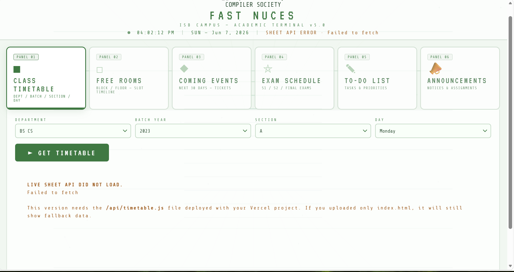
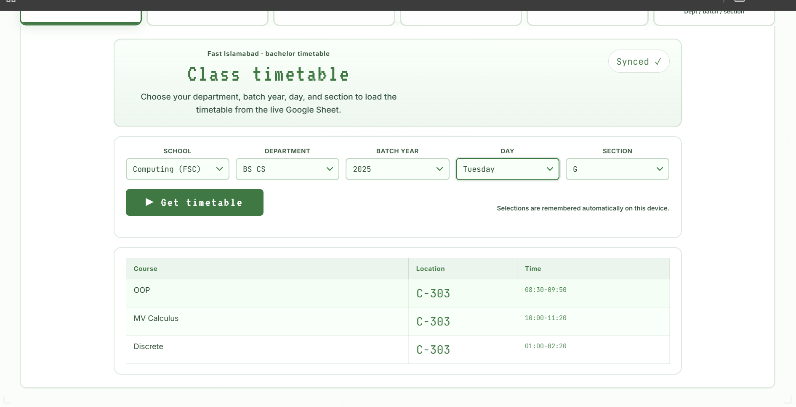
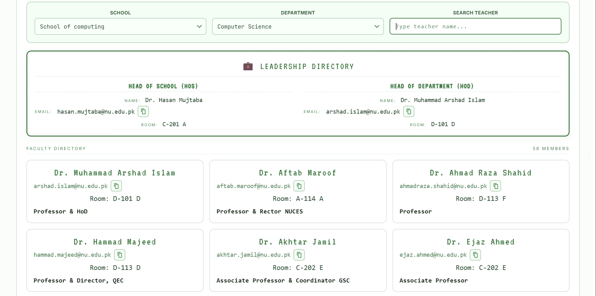
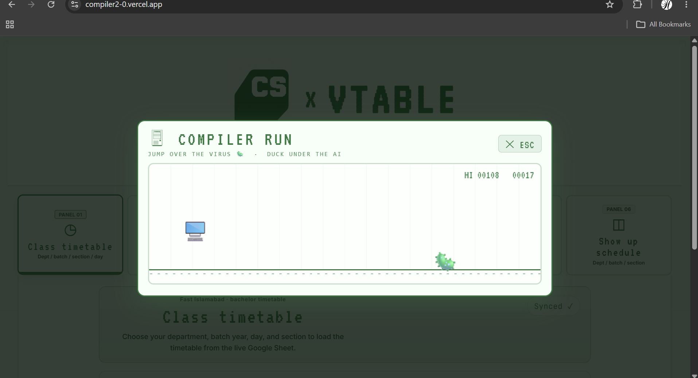

#  VTable

##### A project By Compiler Society

## The problem we solve

#### Excel Sheet Maze

Checking your daily schedule shouldn't feel like debugging legacy code. Standard FAST NUCES timetables are buried    in massive, confusing spreadsheets or clunky portals that are a pain to navigate on the fly.

#### The Empty Room Hunt

Finding an empty classroom for a group project, a study session, or just to kill time between massive gaps usually means wandering down corridors and awkwardly peeking through door windows.

#### The Society Event Bottleneck

For student societies, organizing campus events is an administrative nightmare; manually hunting for open venues, chasing people down for physical ticket sales, and struggling to get the word out effectively.

## Goal

To bridge the gap between campus logistics and student life. VTable replaces the chaotic routine of fragmented PDFs, group chats, and physical notice boards with a clean, unified dashboard built by students, for students.

Our mission is to streamline the FAST experience across all campuses and programs by delivering:

+ Instant Clarity

+ Real Time Room Availability Tracking

+ Society Empowerment

## Visuals

### Home Page

VTable is a campus utility dashboard made to bring the everyday FAST student workflow into one place. The home page is the entry point for the tools students need most often: checking their timetable, finding free rooms, looking up faculty, and taking a quick break with Compiler Run. Instead of treating these as separate scattered tasks, the app keeps them under one clean interface. It is designed to be practical first, so every section focuses on a real campus problem rather than extra clutter. The result is a lightweight companion for navigating academic schedules, room availability, and faculty information throughout the day.

### Timetable

The timetable view is the main academic lookup tool in VTable. It is self evident by design: you enter your school, degree, batch, and section, and the app shows the timetable that matches those choices. This removes the need to search through large spreadsheet tabs just to find one section's schedule. The result is presented in a clean daily layout so students can quickly see their classes, rooms, and time slots. It is meant for fast checking before class, between lectures, or while planning the rest of the day. Because the filters match the way FAST students already think about their schedules, the flow stays simple and familiar. The goal is to make timetable lookup feel instant instead of like digging through a maze of Excel sheets.

### Faculty

The faculty section works like a searchable dictionary of teaching faculty at FAST. It keeps faculty information organized by school and department so students can quickly narrow down who they are looking for. Instead of relying on scattered contacts, old screenshots, or word of mouth, the page gives one structured place to browse faculty details. This is especially useful when a student needs to find a teacher, check a department, or locate official faculty information quickly. The interface is built for lookup rather than decoration, so the important details stay easy to scan. It also helps make department information feel less fragmented across different sources. In short, the faculty view turns teaching staff data into something students can actually search and use.

### FreeRooms

FreeRooms tells you which rooms are free for a given block, day, and floor. It is built for the very real campus problem of needing a place to sit, study, work on a project, or hold a quick meeting. Instead of walking around and checking rooms manually, students can filter the view and see availability from the app. The block and floor filters make the search practical because students usually care about where they already are, not every room on campus. The day selection helps the room list stay tied to the current academic schedule. This makes the tool useful both for quick decisions and for planning ahead between classes. FreeRooms is meant to turn the empty-room hunt into a simple lookup.

### Compiler Run

Compiler Run is a small computer-themed version of the Chrome dinosaur game. It is hidden inside the VTable experience as a playful break from the more practical tools. The runner keeps the same simple idea: avoid obstacles, survive longer, and chase a better score. Instead of the classic dinosaur theme, the visuals are styled around computers and the Compiler Society identity. It gives the project a little personality without getting in the way of the timetable, faculty, or room tools. The game is intentionally lightweight, quick to understand, and easy to replay. It is there because a campus utility can still have a bit of fun tucked inside it.

## Compiler Society

Compiling wild ideas into reality, one broken line of code at a time. We're an unofficial crew of developers, tinkerers, and tech enthusiasts. Forget the stiff networking events — we're here to actually build stuff.

